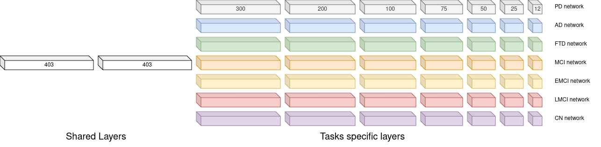
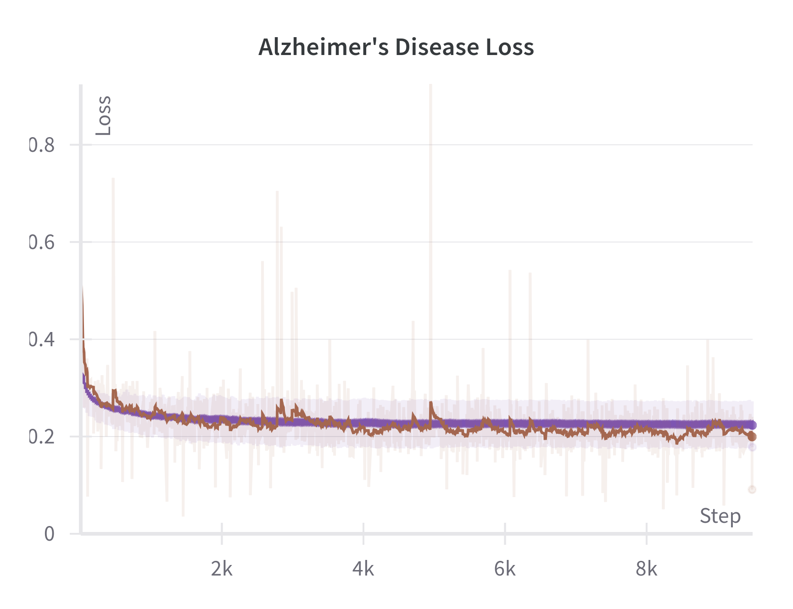
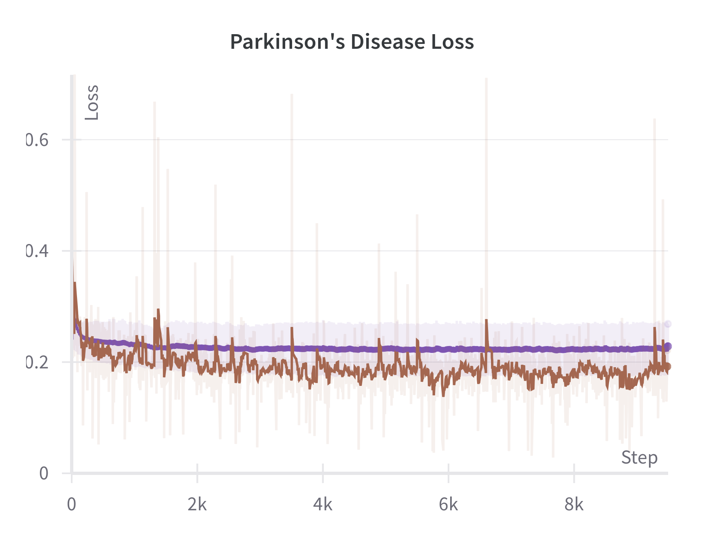
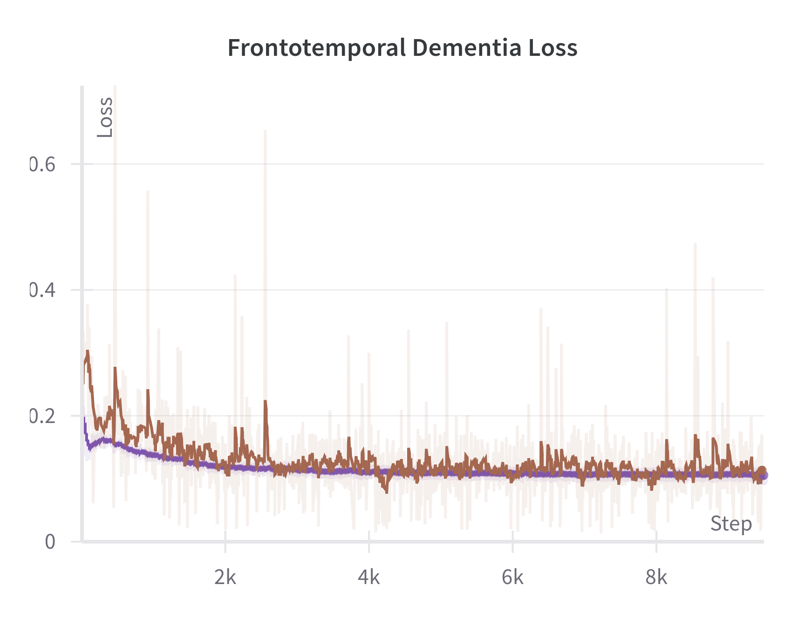
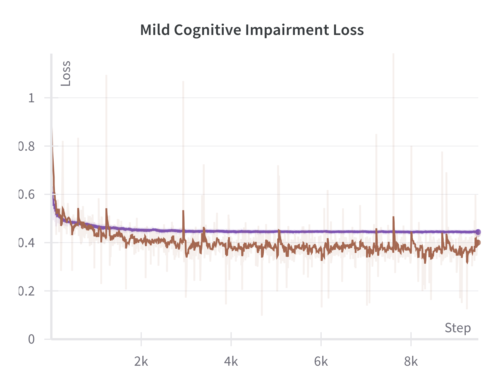
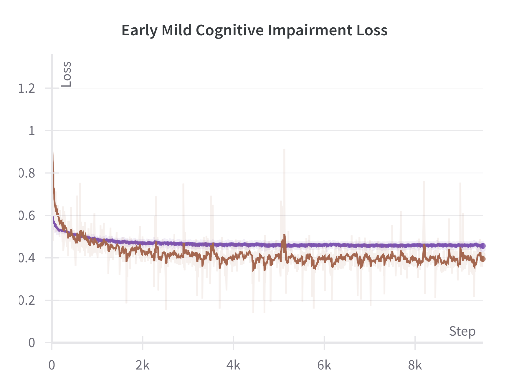
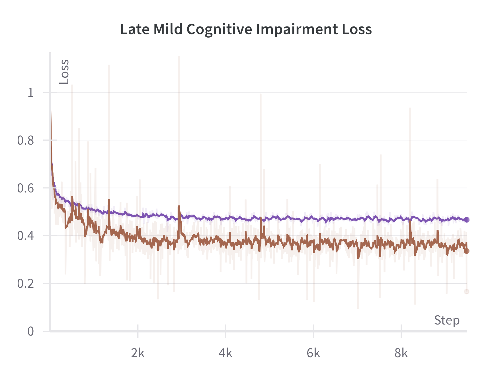

# Multi-task Deep Learning for the Multi-label Prediction of Neurodegenerative Diseases



This repository is the official __PyTorch__ implementation of our work: __Multi-task Deep Learning for the Multi-label Prediction of Neurodegenerative Diseases__, Submitted at J-BHI Special Issue on “Current Trends and Future Directions in Biomedical Data Science”, 2024.

## Set up
### Dependency

To set up the environment and run the experiments, make sure you have Python 3.7 or later. Clone this repository and install the dependencies.

  ```bash
  $ git clone https://github.com/ThomBors/MTLforMLNDs.git
  $ cd MTLforMLNDs
  $ python -m venv myenv
  $ source myenv/bin/activate
  $ pip install -U pip
  $ pip install -r requirements.txt
  ``` 

### Folder organization

The folders in this repository are organised into two main folders

#### MTLExperiments
```
MTLforMLNDs
└── MTLExperiment     
    ├── MTL
    |   ├── experiments_all
    |   └── experiments_mtl
    ├── Network
    ├── STL
    |   ├── experiments_AlternativeNet50
    |   ├── experiments_AlternativeNet500
    |   └── experiments_stl
    ├── MultiTask.log
    ├── singleTask.log
    └── run_dep.py
```

This folder contains the code, the networks, and the results of the experiments conducted. The data in this folder are split into folders (training set, validation set, and test set); therefore, the results are reported for both the validation set and the test set.

As mentioned in the paper, we take into account the results from the validation set in this face in order not to introduce any bias on the test set.

The STL folder contains code to train and test all the different single-task networks discussed in the paper, the main results are in the `experiments_stl` folder, the other folders report the results for the larger network trained for 50 epochs `experiments_AlternativeNet50` and for 500 epochs `experiments_AlternativeNet500`.

The MTL folder contains the code to train and test the different tuning techniques presented in the paper, and the `experiments_mtl` folder contains the result of the __TSTL-Tuning-EarlyStop__. In contrast, the `experiments_all` folder contains the results of the other experiments.

#### MTLDeploy

```
MTLforMLNDs
└── MTLDeploy
    ├── MTL
    |   ├── Results_mtl_Gender
    |   └── experiments_mtl
    ├── Network
    ├── STL
    |   └── experiments_stl
    ├── Multi.log
    ├── single.log
    └── run_dep.py
```
This folder contains the final models discussed in the paper. The models in this folder are trained on the combined training and validation sets and tested only on the test set, so the results reported are only on the test set.

The folder structure is mostly similar to the previous one, with the exception of the `Results_mtl_Gender` folder, which contains the results stratified by gender.


## Training

To train the models for the experiments in the MTLExpriments folder, run `run_exp.py'.


  ```bash
  $ cd MTLExperiments
  $ python run_exp.py
  ``` 


Similarly, for the deployment of the model, where it is necessary to run `run_dep.py` 

  ```bash
  $ cd MTLDeploy
  $ python run_dep.py
  ``` 


## Reproducibility
### Environment

All our experiments are implemented in Python and based on the PyTorch framework, using a 24G NVIDIA RTX A5000 GPU.

The list of required packages can be found in the file requirements.txt.

### Data Preparation

The data used in this paper are freely available from each of the data repositories we consulted.

Due to the data policies of the data repositories, we are not allowed to share the original data and our pre-processed data. Therefore, to reproduce the data used in our experiments, it is necessary to download the original MRI scans from:

* [Alzheimer’s Disease Neuroimaging Initiative (ADNI)](https://adni.loni.usc.edu/)
* [Australian Imaging, Biomarker and Lifestyle (AIBL)](https://aibl.org.au/)
* [Information eXtraction from Images (IXI)](https://brain-development.org/ixi-dataset/)
* [Neuroimaging in Frontotemporal Dementia (NIFD)](https://ida.loni.usc.edu/login.jsp)
* [Parkinson's Progression Markers Initiative (PPMI)](https://www.ppmi-info.org/)


The data must then be processed using the [FreeSurfer softwer](https://surfer.nmr.mgh.harvard.edu/). All the detailed steps are described in the Materials and Methods section of the paper.

For reproducibility purposes, the file MRI_id.csv provides the IDs of the images used for the experiments.


## Training Loss

Below are provided additional images showing the training loss over steps for each of the diseases considered. These images can help understand the model's convergence behaviour and performance.

| | | |
|-|-|-|
 |  |  
 |  | 


These plots highlight the training dynamics across different diseases. Consistent patterns in the loss curves suggest that the training process is stable, and there is no overfitting for a single disease.

